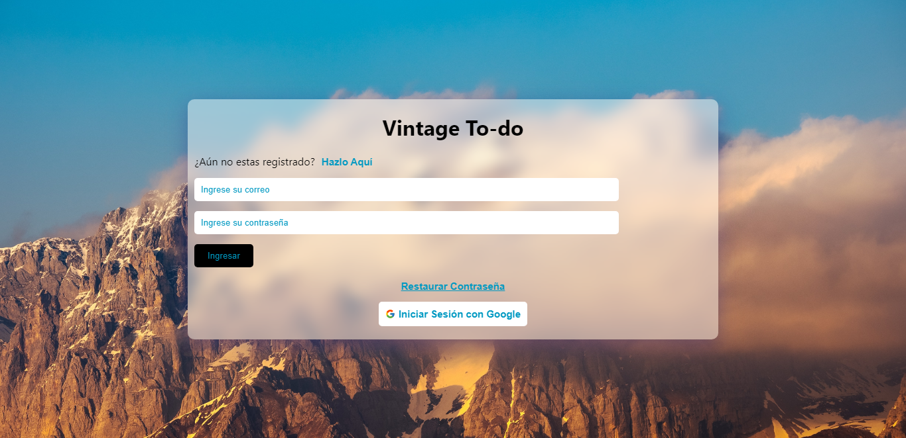

# Vintage To-do

Esta app fue desarrollada con las siguientes tecnologías:
* React JS
* Firebase

**Desplegada en netlify**

Usa el enrutador de react (react-router-dom) para dividir las diferentes páginas en las que esta compuesta. 

Usa conceptos de react como lo son:
* manejo del estado con useState
* manejo de un contexto global con useContext
* manejo de efectos con useEffect 

Contiene animaciones y estilos desarrolladas con css puro.

## Preview

[Demo](https://vintage-to-do.netlify.app/)
